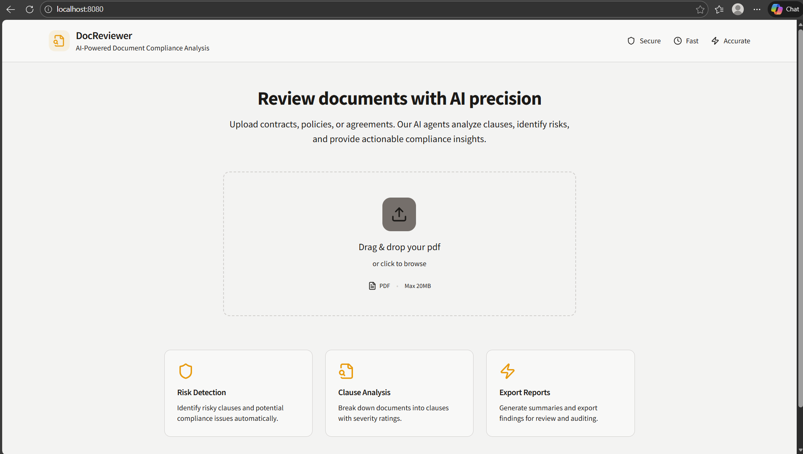
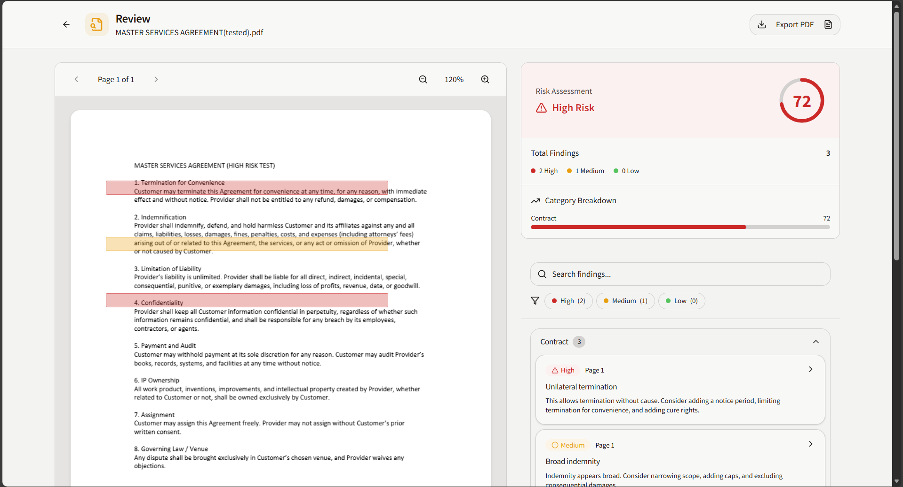
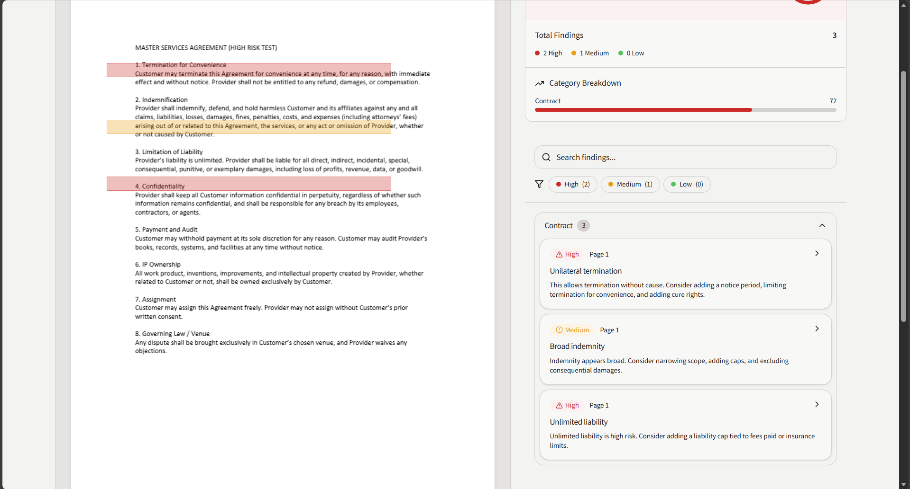

# Doc Review Buddy 🧠📄

## 🎬 Demo

Watch a short walkthrough of the app demo on YouTube:

[](https://youtu.be/RwQR59OQoTI)

[Watch the demo video](https://youtu.be/RwQR59OQoTI)

**Smart Contract & Policy Reviewer (Document AI SaaS)**

Doc Review Buddy is a full-stack Document AI application that allows users to upload contracts (PDF, DOCX, TXT), automatically analyze them for legal/compliance risks, and generate explainable findings with risk scores.

This project is designed as a **realistic SaaS-style MVP** using **Cloudflare Workers, Durable Objects, and Agents**, with **$0 cost for local and low usage**.

# Doc Review Buddy 🧠📄

## 🎬 Demo

Watch a short walkthrough of the app demo on YouTube:

[](https://youtu.be/RwQR59OQoTI)

[Watch the demo video](https://youtu.be/RwQR59OQoTI)

**Smart Contract & Policy Reviewer (Document AI SaaS)**

Doc Review Buddy is a full-stack Document AI application that allows users to upload contracts (PDF, DOCX, TXT), automatically analyze them for legal/compliance risks, and generate explainable findings with risk scores.

This project is designed as a **realistic SaaS-style MVP** using **Cloudflare Workers, Durable Objects, and Agents**, with **$0 cost for local and low usage**.

---

## ✨ Features

### Frontend

- Upload documents (PDF, DOCX, TXT)
- PDF viewer with zoom, pagination, and highlights
- Risk dashboard with:
  - Overall risk score
  - Severity breakdown (High / Medium / Low)
- Findings panel with filtering and search
- Export review results

### Backend

- Stateless API using Cloudflare Workers
- Stateful AI agents using Durable Objects
- Clause extraction agent
- Compliance/risk analysis agent
- Explainable, rule-based findings (no paid LLMs required)

---

## 🧱 Architecture Overview

Frontend (React + Vite)
|
| REST API
v
Cloudflare Worker (API Gateway)
|
+--> ClauseExtractionAgent (Durable Object + SQLite)
|
+--> ComplianceAgent (Durable Object + SQLite)

- **No R2 / no paid services**
- Uses **Durable Objects SQLite** for state
- Uses **PDF.js** in the browser for PDF rendering

---

## 🚀 Tech Stack

### Frontend

- React + TypeScript
- Vite
- shadcn/ui
- PDF.js
- Zustand (state management)

### Backend

- Cloudflare Workers
- Cloudflare Durable Objects
- Cloudflare Agents SDK
- SQLite (Durable Object storage)

---

## 📂 Project Structure

doc-review-buddy/
├─ doc-review-buddy-ui/ # Frontend (React)
│ ├─ src/
│ │ ├─ components/
│ │ ├─ pages/
│ │ ├─ lib/
│ │ └─ types/
│
├─ doc-review-buddy-api/ # Backend (Cloudflare Worker)
│ ├─ src/
│ │ ├─ agents/
│ │ │ ├─ ClauseExtractionAgent.ts
│ │ │ └─ ComplianceAgent.ts
│ │ └─ index.ts
│ ├─ wrangler.json
│
├─ README.md
└─ PROMPT.md

---

## 🛠 Local Development

### 1️⃣ Start Backend

```bash
cd doc-review-buddy-api
npm install
npm run dev
```

Backend runs at:

```text
http://127.0.0.1:8787
```

### 2️⃣ Start Frontend

```bash
cd doc-review-buddy-ui
npm install
npm run dev
```

Frontend runs at:

```text
http://localhost:8080
```

🔁 API Flow

Create document

```http
POST /doc/create → { docId }
```

Upload extracted text

```http
POST /doc/:docId/text
```

Run review

```http
POST /doc/:docId/run
```

Fetch results

```http
GET /doc/:docId/results
```

📌 Supported File Types

Type Accepted Preview
PDF ✅ ✅
DOCX ✅ ❌
TXT ✅ ❌

DOCX and TXT are fully analyzed, but only PDFs support visual preview and highlights.

🧪 Example High-Risk Clauses Detected

- Unilateral termination
- Broad indemnification
- Unlimited liability
- Perpetual confidentiality (low severity)

🧠 Why This Project Matters

- Demonstrates real SaaS architecture
- Combines frontend + backend + AI agents
- Uses Cloudflare’s edge-first stack
- Free to run locally and cheap to scale
- Enterprise-relevant legal/compliance use case

📈 Next Possible Improvements

- DOCX → HTML preview
- TXT preview panel
- LLM-powered clause reasoning
- Policy memory & versioning
- Multi-tenant auth
- Export to PDF report

Preview screenshots from the running app (place these files in `doc-review-buddy-ui/public/`):







⚠️ Disclaimer
This project is for educational/demo purposes only and does not constitute legal advice.
